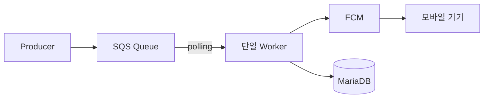
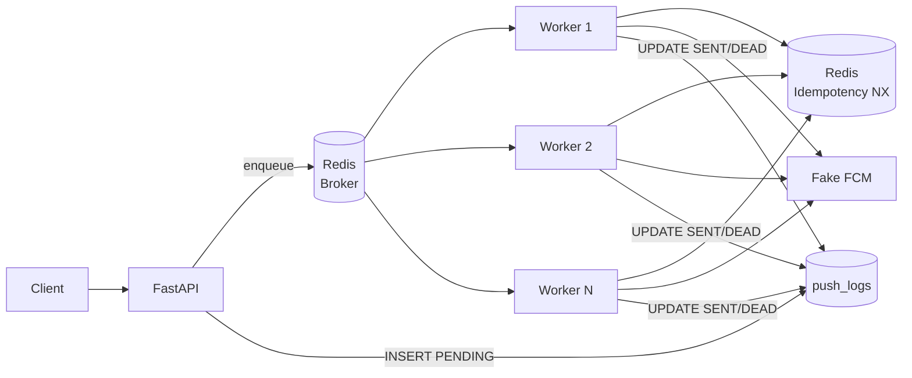

# push-practice

> FastAPI + Celery + Redis 기반 멀티 워커 환경에서 **멱등성**과 **DLQ**를 구현한 비동기 푸시 알림 시스템

단위 테스트 · E2E 테스트 **27개, 커버리지 97%**

---

## 배경

실무에서 Node.js + SQS로 운영하던 푸시 시스템의 구조적 한계를 재현하고, Python + Celery로 근본적으로 해결하는 것을 목표로 재구현했다.

### v1 한계 (Node.js + SQS)

| 문제 | 대응 | 한계 |
|---|---|---|
| 단일 워커 구조 | 큐 유형별 단일 워커로 분리 운영 | 수평 확장 시 전체 로직 수정 불가피 |
| Visibility Timeout 초과 → 중복 처리 | 선 삭제 후 처리 | 처리 실패 시 메시지 유실, 수동 복구 필요 |
| Worker crash → 메시지 유실 | 성공/실패 이중 로그로 상태 추적 | crash 시점에 따라 누락, 수동 복구 필요 |

### v2 해결 전략 (Python + Celery)

| 문제 | 해결 | 근거 |
|---|---|---|
| 중복 처리 | Redis `SET NX EX` 멱등성 키 | 서버 사이드 atomic 연산 — 멀티 워커 환경에서도 단 1번만 처리 보장 |
| 메시지 유실 | `acks_late=True` + `reject_on_worker_lost=True` | 처리 완료 후 ack → crash 시 브로커가 메시지 재전달 |
| 재시도 후 영구 실패 | DLQ (`push_logs.status = 'DEAD'`) + 재처리 API | 별도 큐 없이 DB 상태 컬럼으로 관리, 운영 복잡도 최소화 |

---

## 아키텍처

### v1 — Node.js + SQS (Before)



당시 환경에서는 약 6개월간 안정적으로 운영됐으나, 멀티 워커로 확장할 경우 전체 로직 수정이 불가피한 구조였다.

### v2 — FastAPI + Celery + Redis (After)



API는 enqueue만 담당하고, 실질적인 처리는 worker에서만 수행한다. FCM은 Fake로 동작하며, 랜덤 성공/실패로 멱등성·재시도·DLQ 흐름을 검증한다.

---

## 핵심 설계 결정

### Python + FastAPI 선택

SQS가 큐 인프라를 제공하기 때문에 실제 내부 동작을 경험할 기회가 적었다. Celery를 직접 구성하며 분산 태스크 큐의 동작 원리를 이해하는 것이 이 프로젝트의 주요 목적 중 하나였다. 또한, FastAPI의 `async/await` 패턴이 Node.js와 유사해 빠르게 적응할 수 있었다.

### Thread 대신 Celery 선택

Python GIL로 인해 스레드는 병렬 처리에 한계가 있고, 메모리를 공유하기 때문에 동시성 문제와 데이터 정합성을 직접 관리해야 한다. crash 시 스레드 내 작업이 모두 유실되는 문제도 있다. Celery는 별도 프로세스로 메모리를 공유하지 않아 Redis atomic 연산만으로 정합성을 보장할 수 있으며, 브로커 기반으로 `acks_late` 재전달·retry·DLQ를 별도 구현 없이 지원한다.

### 멱등성 — 처리 시작 전 NX 키 선점

```
SET idempotency:{key} "1" EX 86400 NX
```

Worker가 처리를 시작하기 전에 Redis에 atomic하게 키를 선점한다. 멀티 워커 환경에서 동일 메시지를 여러 워커가 동시에 dequeue하더라도, NX 연산은 서버 사이드 atomic이므로 정확히 1개 워커만 처리를 계속한다.

**트레이드오프**: 키를 처리 완료 전에 설정하므로, 처리 도중 crash가 발생하면 재시도 시 해당 키가 이미 존재해 재처리가 차단될 수 있다. 현재는 이 트레이드오프를 의도적으로 수용하고 DLQ + 수동 재처리로 대응한다.

### DLQ — 별도 큐 없이 DB 상태로 관리

별도 Redis List 없이 `push_logs.status = 'DEAD'`를 DLQ로 사용한다. 운영 환경에서 별도 큐를 추가하면 모니터링 포인트가 늘어나고 일관성 관리가 복잡해진다. DB 상태 컬럼 하나로 관리하면 조회, 재처리 API를 단순하게 유지할 수 있다.

- max_retries(3) 초과 → `status = 'DEAD'`, `failed_at` 기록
- 재처리: `POST /dlq/{idempotency_key}/retry` → Redis 키 삭제 + `status = 'PENDING'` + re-enqueue

### 재시도 (지수 백오프)

| 시도 | 대기 시간 |
|---|---|
| 1차 | 60초 |
| 2차 | 120초 |
| 3차 | 240초 |
| 초과 | DLQ |

---

## 기술 스택

| 역할 | 기술 |
|---|---|
| API 서버 | FastAPI |
| 비동기 처리 | Celery |
| 메시지 브로커 | Redis (DB0) |
| 멱등성 저장소 | Redis (DB2) |
| 영구 저장소 | Supabase (PostgreSQL) |
| 워커 모니터링 | Flower |
| 패키지 관리 | uv |
| 린트/포맷 | ruff |
| 테스트 | pytest |

---

## 시작하기

### 사전 준비

- Python 3.12+
- [uv](https://docs.astral.sh/uv/)
- Docker (Redis 실행용)
- Supabase 프로젝트 (또는 로컬 PostgreSQL)

### 환경 설정

```bash
cp .env.example .env
# .env에 SUPABASE_URL, SUPABASE_KEY, REDIS_URL 등 설정
```

### Redis 실행

```bash
docker run -d -p 6379:6379 redis:7
```

### 앱 실행

```bash
uv run fastapi dev app/main.py                                        # FastAPI 개발 서버 (포트 8000)
uv run celery -A app.worker worker --loglevel=info                    # Celery 워커 실행 (별도 터미널)
uv run celery -A app.worker worker --loglevel=info --concurrency=4    # 멀티 워커 실행 (concurrency=4)
uv run celery -A app.worker flower --port=5500                        # Flower 모니터링
```

---

## API

| 메서드 | 경로 | 설명 |
|---|---|---|
| `POST` | `/push` | 전체 유저 대상 푸시 전송 요청 |
| `GET` | `/push/{push_id}` | 푸시 상태 조회 |
| `GET` | `/dlq` | DLQ 목록 조회 |
| `POST` | `/dlq/{idempotency_key}/retry` | DLQ 메시지 재처리 |

- Base URL: `http://localhost:8000`
- Flower: `http://localhost:5500`

자세한 명세는 [`docs/api.md`](docs/api.md)를 참조한다.

---

## 테스트

```bash
uv run pytest                                           # 전체
uv run pytest tests/unit/                               # 단위 (services, celery tasks)
uv run pytest tests/e2e/                                # E2E
uv run pytest --html=report.html --self-contained-html  # HTML 리포트
```

### 테스트 현황 — 27개 · 커버리지 97%

| 분류 | 파일 | 검증 내용 |
|---|---|---|
| 단위 | `test_idempotency.py` | SET NX 신규/중복 반환값 |
| 단위 | `test_push_task.py` | 멱등성 조기 종료 · 재시도 백오프 · DEAD 전환 |
| 단위 | `test_fake_fcm.py` | 성공률 0.0 / 1.0 경계값 |
| 단위 | `test_dlq_api.py` | DLQ 목록 조회 · 빈 목록 · 재처리 200 · 404 |
| E2E | `test_push_api.py` | POST /push · GET /push/{id} 상태 조회 |
| E2E | `test_dlq_api.py` | DEAD 목록 조회 · 재처리 후 PENDING 전환 |
| E2E | `test_idempotency_concurrency.py` | 10-thread 동시 SET NX → 정확히 1개만 성공 |
| E2E | `test_worker_crash.py` | retry 소진 → DEAD · acks_late 설정 확인 |

---

## 문서

| 문서 | 내용 |
|---|---|
| [`docs/architecture.md`](docs/architecture.md) | 전체 아키텍처 및 이벤트 흐름 |
| [`docs/api.md`](docs/api.md) | API 명세 |
| [`docs/database.md`](docs/database.md) | DB 스키마 및 Redis 키 설계 |
| [`docs/messaging.md`](docs/messaging.md) | Celery 설정 및 멱등성/DLQ 처리 |
| [`docs/push.md`](docs/push.md) | Fake FCM 동작 및 전송 흐름 |
| [`docs/testing.md`](docs/testing.md) | 테스트 전략 및 예시 |
